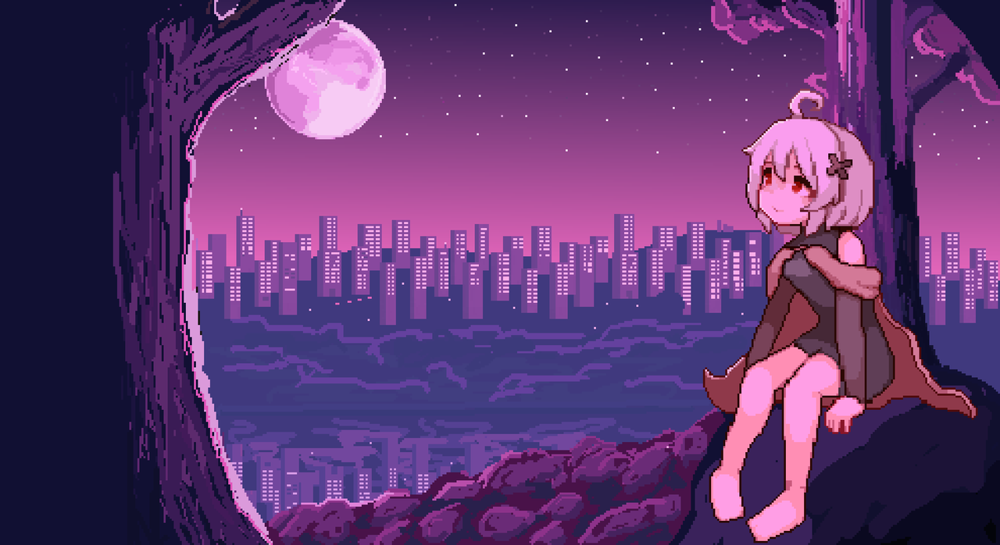
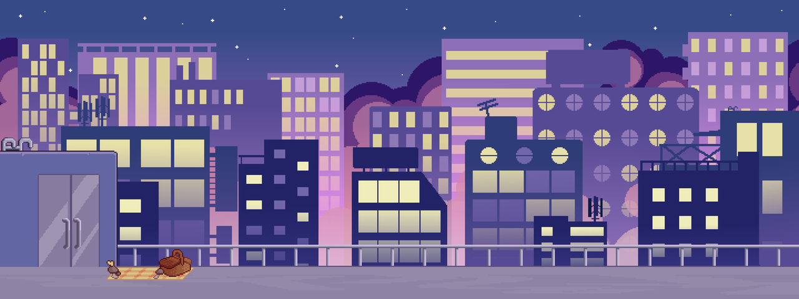
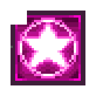
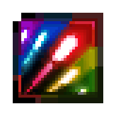
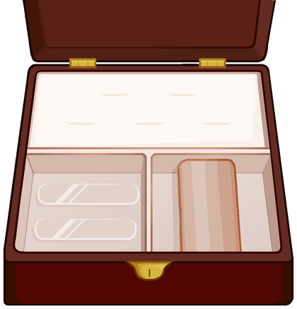
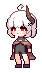
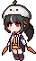
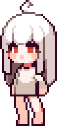

<a href="./README.md">한국어</a> · <b>English</b>

  

  A <b>2D bullet-hell action</b> game on a moonlit rooftop. 
  Cut through patterns with dash and flight, then rewrite the fight with jewelry.

  

---

## About

**Lumen** is a boss-rush set on a night-city rooftop.
Talk to NPCs in the lobby, pick your loadout, then step into phased boss fights.

Movement, jump, dash, and flight chain into one motion.
Rings, bracelets, and nails decide how you survive and how you fire.

  

Lobby / combat stage — a rooftop over the city lights

---

## Controls

| Input | Action |
| --- | --- |
| `A` `D` / ← → | Move |
| `Space` | Jump · hold to stay airborne |
| `Left Shift` / Right-click | Dash · hold to fly |
| `W` + dash | Enter flight |
| Left-click | Attack (shots or laser, depending on bracelet) |
| `Q` | Equipped nail skill |
| `F` | Talk to an NPC |
| `Esc` | Settings · close dialogue |

Dash and flight spend the **energy gauge**. Standing on the ground restores it.

---

## Combat

- **Dash** — a short invincible burst on the ground. Hold to travel farther.
- **Flight** — chain off a dash to move freely in the air. You are invincible, but the gauge drains fast.
- **Skill gauge** — fills as you damage the boss. Press `Q` to use a nail skill.
- **Phases** — each time the boss's HP hits zero, the pattern changes. Orbitals, homing shots, and falling bullets mix together.

  
  &nbsp;&nbsp;
  

Nail skills — Star Echo · Rainbow Spark

---

## Loadout

Finish talking to the shop NPC in the lobby to open the jewelry box.
You can equip **2 rings, 1 bracelet, and 1 nail** at once.

  

| | Name | Slot | Effect |
| :---: | --- | --- | --- |
|  | Heart Locket | Ring | +1 max life |
|  | Star Ring | Ring | Slightly more max energy |
|  | Eris Bracelet | Bracelet | Basic projectile attack |
|  | Luna Bracelet | Bracelet | Laser attack |
|  | Star Echo | Nail | Clears nearby bullets |
|  | Rainbow Spark | Nail | Invincibility + fire rate *(in development)* |

Equipped items are saved as JSON and reapplied when a boss scene loads.

---

## Characters

  
  &nbsp;&nbsp;&nbsp;
  
  &nbsp;&nbsp;&nbsp;
  

Player · Boss · Boss portrait

  
  &nbsp;&nbsp;&nbsp;
  
  &nbsp;&nbsp;&nbsp;
  
  &nbsp;&nbsp;&nbsp;
  

Lobby NPCs — dialogue, shop, and boss entrances

Press `F` to start a typed conversation. Depending on the NPC, you open the shop, the first boss, or the second boss.

---

## Scenes

| Scene | Role |
| --- | --- |
| `Main` | Title — start / quit |
| `Lobby` | Hub — NPCs, loadout, boss select |
| `Game` | Boss fight |
| `Boss2` | Second boss fight |

The loop is **title → lobby → boss**. Dying sends you back to the lobby.

---

## How to run

1. Open this repo in **Unity 2021.3.45f2** (URP).
2. Press Play on `Assets/Scenes/Main.unity`.
3. Start the game to enter the lobby.

The game is built around keyboard + mouse.

---

## Stack

| | |
| --- | --- |
| Engine | Unity 2021.3 LTS · URP |
| Motion / juice | Cinemachine · DOTween · Feel |
| Bullets | BulletPro |
| Data | Odin Inspector · Newtonsoft JSON · TextMesh Pro |

Made by **ChoCollect**
