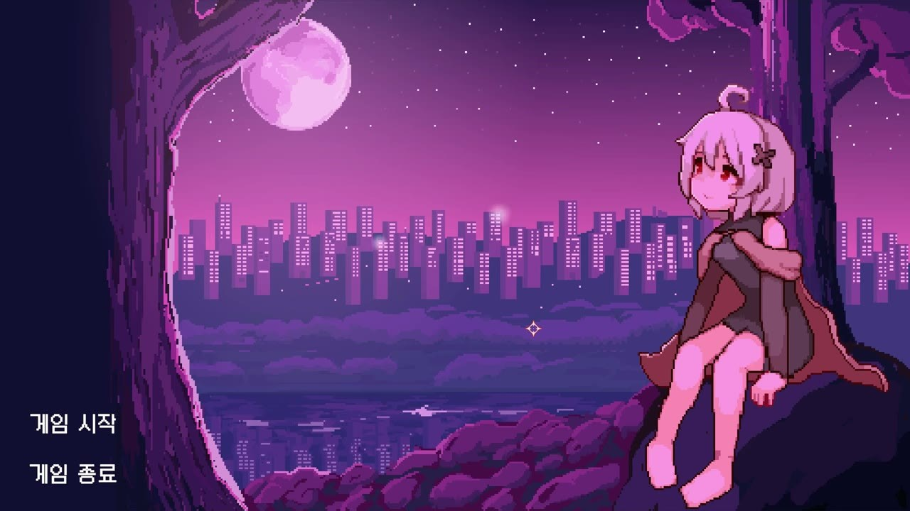
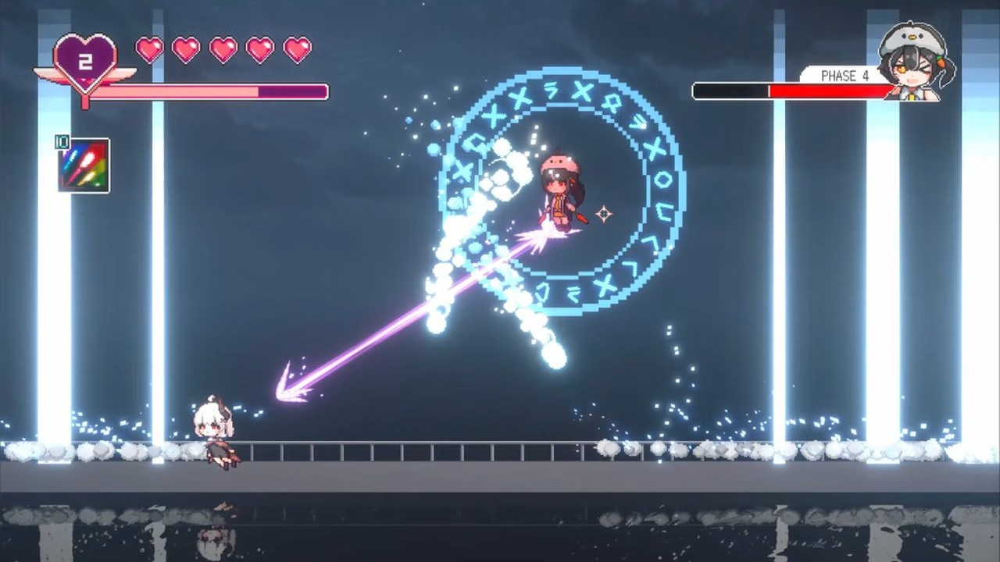

[한국어](README.md) · **English**

A 2D bullet-hell action game on a moonlit rooftop  
Cut through patterns with dash and flight

  

   

## Demo

## About

Have you ever wanted to cut through a bullet hell and drop a boss in one sitting?

Team **ChoCollect** took that rush and put it on a night-city rooftop — short boss rushes, jewelry loadouts, dash and flight in one motion.
Talk in the lobby, pick a build, then step into fights that change every phase.

One more gap and you're through. One hit and you're back on the roof.
The boss still falls, so you dash again.

## Screenshots

|                                                              |                                                                              |
| ------------------------------------------------------------ | ---------------------------------------------------------------------------- |
|  **Main screen**       |  **Lobby**                             |
|  **Dialogue**    |  **Inventory**                   |
|  **Combat**      |  **Attack changes with the bracelet** |
|  **Cut through the barrage and push the boss back** |  **Various boss patterns** |

## Controls

| Action        | Keys                     | What it does                                      |
| ------------- | ------------------------ | ------------------------------------------------- |
| Move          | `A` `D` / ← →            | Move left and right                               |
| Jump          | `Space`                  | Jump, and hold to stay airborne a little longer   |
| Dash · Flight | `Left Shift` / Right-click | Tap to dash, hold to chain into flight          |
| Enter flight  | `W` + dash               | Lift off and start flying                         |
| Attack        | Left-click               | Fire shots or a laser, depending on the bracelet  |
| Nail skill    | `Q`                      | Use the equipped nail skill                       |
| Talk          | `F`                      | Talk to an NPC                                    |
| Menu          | `Esc`                    | Open settings or close dialogue                   |

Dash and flight spend the **energy gauge**. Standing on the ground fills it back up.
**Title → lobby → boss.** Dying sends you back to the lobby.

## Features

- **Dash and flight** — a short invincible burst on the ground, then free movement in the air
- **Phased bosses** — orbitals, homing shots, and falling bullets mix each time HP hits zero
- **Jewelry loadout** — 2 rings, 1 bracelet, and 1 nail change your HP, attack, and skill
- **Rooftop lobby** — talk to NPCs, open the shop, then walk into a boss
- **Bullet-hell cuts** — dash through a line, or clear nearby shots with a nail
- **macOS / Windows** — grab a build from Releases and play

## Team

|                                                                                                                    |                                                                                                |                                                                                                         |
| ------------------------------------------------------------------------------------------------------------------ | ---------------------------------------------------------------------------------------------- | ------------------------------------------------------------------------------------------------------- |
|  **sleeeppy** Developer / Game Design [@sleeeppy](https://github.com/sleeeppy) |  **Yujun** Developer [@yujun07](https://github.com/yujun07) |  **Hyunseo Choi** Designer [@unicorn0323](https://github.com/unicorn0323) |

Made by **ChoCollect**  |  Genre · Bullet hell / Boss rush
