
<b>한국어</b> · <a href="./README.en.md">English</a>

  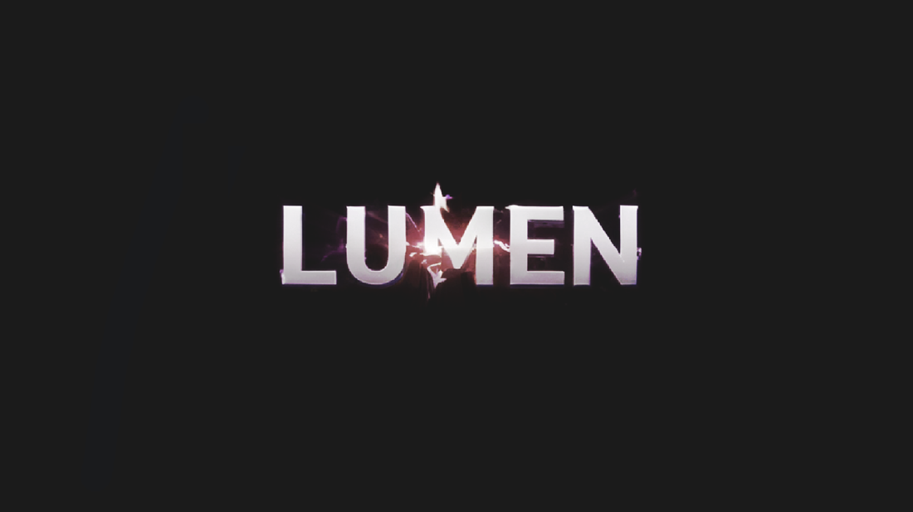

  달빛 아래 옥상에서 펼쳐지는 <b>2D 탄막 액션</b> 
  대시와 비행으로 탄막을 가르고, 장신구로 전투를 바꿉니다.

  
  
  

  <a href="https://github.com/sleeeppy/Lumen/releases/latest/download/Lumen-macOS.zip"><b>⬇ 게임 다운로드</b></a>
  &nbsp;·&nbsp;
  <a href="https://youtu.be/kgnrUYgdiXc"><b>▶ 시연 영상</b></a>

  <a href="https://youtu.be/kgnrUYgdiXc">
    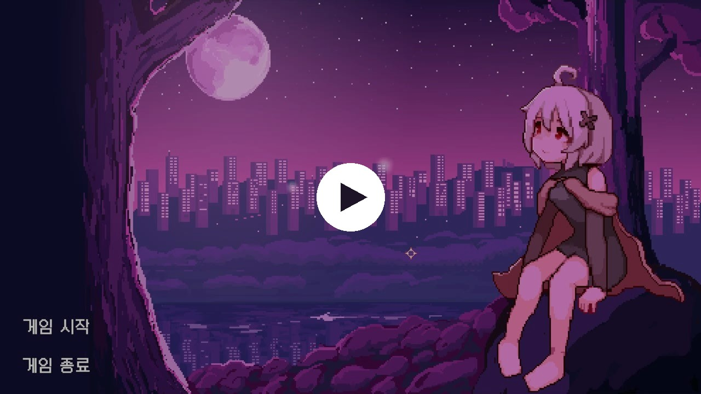
  </a>

---

## 게임 화면

<table>
  <tr>
    <td width="50%">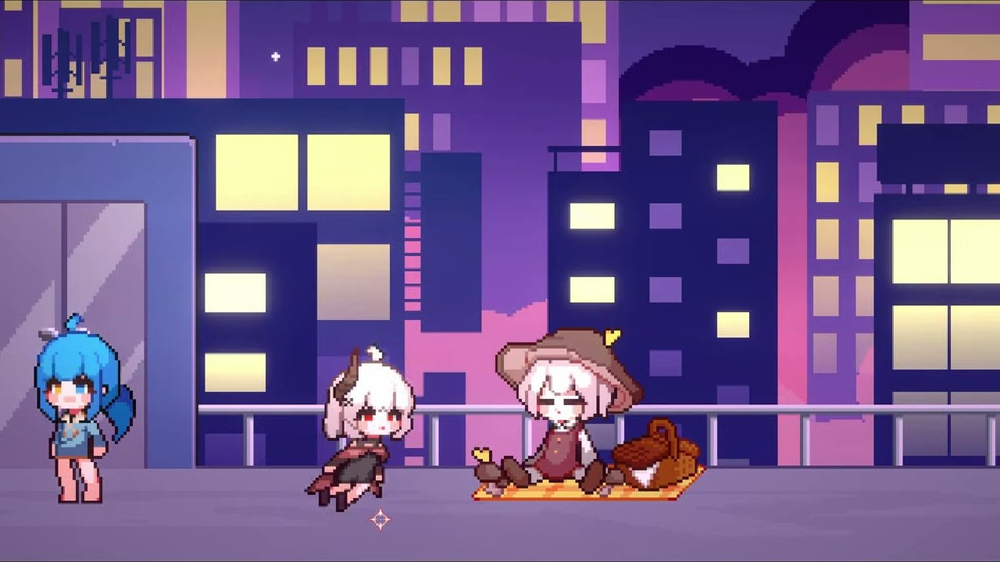</td>
    <td width="50%">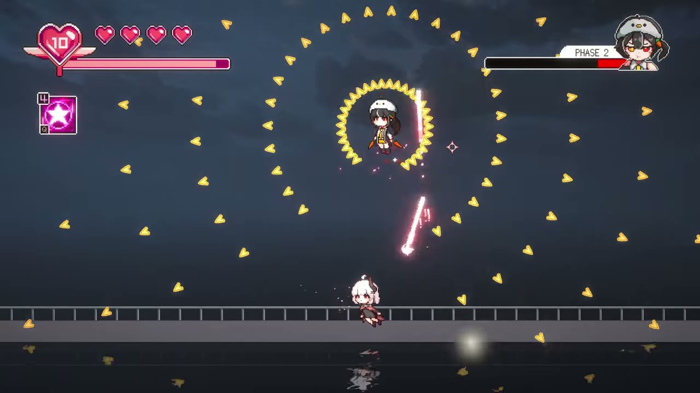</td>
  </tr>
  <tr>
    <td align="center">로비 — 야경 옥상에서 NPC를 만납니다</td>
    <td align="center">보스전 — 페이즈마다 탄막이 바뀝니다</td>
  </tr>
  <tr>
    <td>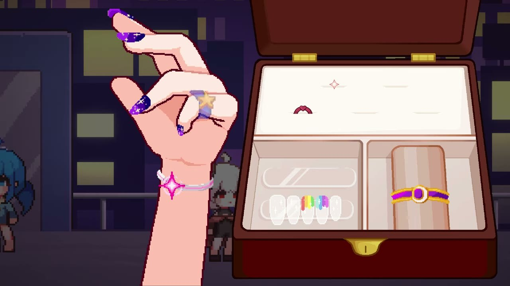</td>
    <td>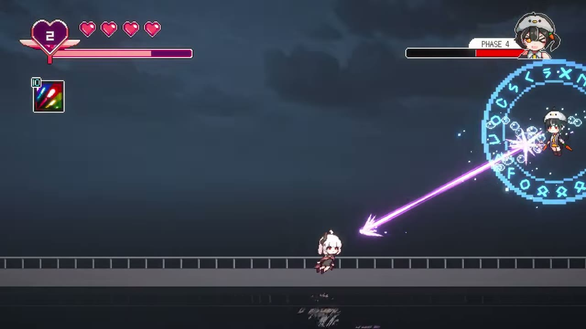</td>
  </tr>
  <tr>
    <td align="center">장비 — 반지 · 팔찌 · 네일로 빌드를 고릅니다</td>
    <td align="center">공격 — 팔찌에 따라 탄환 또는 레이저</td>
  </tr>
</table>

  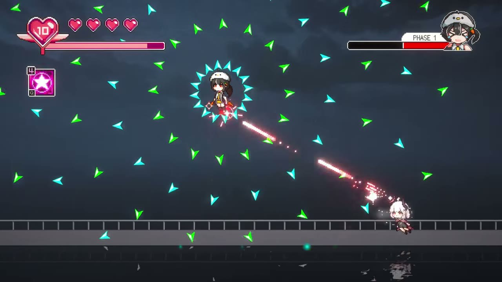

탄막을 가르며 보스를 밀어붙이세요

---

## 소개

**Lumen**은 밤의 도시 옥상을 배경으로 한 보스 러시입니다.
로비에서 대화를 나누고 장비를 고른 뒤, 페이즈가 갈리는 보스전으로 들어갑니다.

이동 · 점프 · 대시 · 비행이 한 흐름으로 이어집니다.

---

## 조작

| 입력 | 동작 |
| --- | --- |
| `A` `D` / ← → | 이동 |
| `Space` | 점프 · 길게 누르면 체공 |
| `Left Shift` / 우클릭 | 대시 · 유지하면 비행 |
| `W` + 대시 | 비행 전환 |
| 좌클릭 | 공격 (팔찌에 따라 탄환 / 레이저) |
| `Q` | 장착한 네일 스킬 |
| `F` | NPC 대화 |
| `Esc` | 설정 · 대화 닫기 |

대시와 비행은 **에너지 게이지**를 씁니다. 땅에 서 있으면 다시 찹니다.

---

## 전투

- **대시** — 지상에서 짧게 무적이 되며 탄막을 빠져나갑니다.
- **비행** — 대시를 이어서 공중을 누빕니다. 무적이지만 게이지가 빨리 줄어듭니다.
- **스킬** — 보스에게 피해를 주면 게이지가 찹니다. `Q`로 네일을 씁니다.
- **페이즈** — 체력이 바닥날 때마다 궤도탄, 유도탄, 낙하탄이 섞입니다.

---

## 장비

상점 NPC와 대화를 마치면 보석함이 열립니다.
**반지 2개 · 팔찌 1개 · 네일 1개**까지 동시에 낄 수 있습니다.

| | 이름 | 분류 | 효과 |
| :---: | --- | --- | --- |
|  | 하트 로켓 | 반지 | 최대 체력 +1 |
|  | 별의 반지 | 반지 | 최대 에너지 증가 |
| 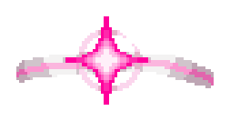 | 에리스의 팔찌 | 팔찌 | 기본 탄환 공격 |
| 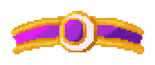 | 루나의 팔찌 | 팔찌 | 레이저 공격 |
| 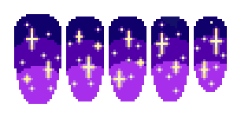 | 별의 메아리 | 네일 | 주변 탄막 제거 |
|  | 레인보우 스파크 | 네일 | 무적 + 공격속도 *(개발 중)* |

---

## 등장인물

  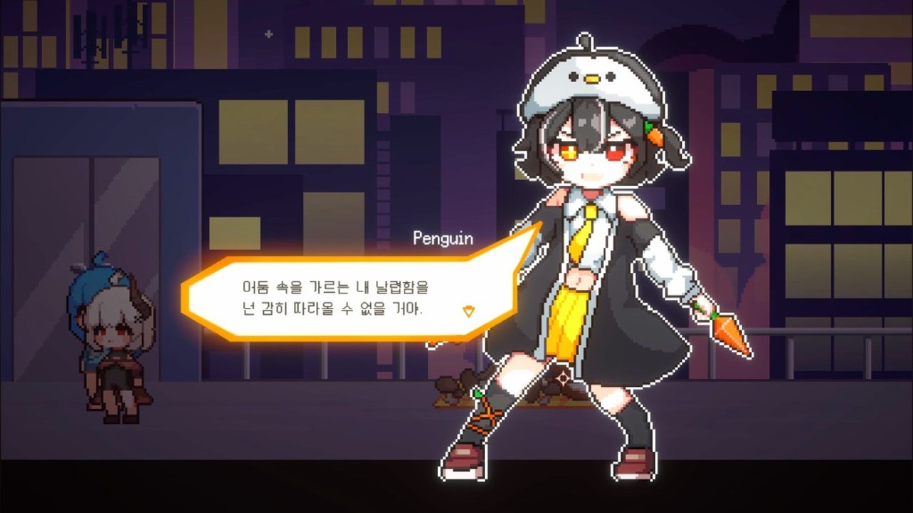

`F`로 말을 걸면 타이핑 대화가 이어집니다

  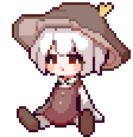
  &nbsp;&nbsp;&nbsp;
  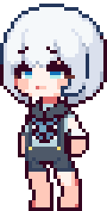
  &nbsp;&nbsp;&nbsp;
  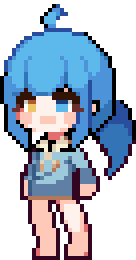

NPC에 따라 상점, 첫 번째 보스, 두 번째 보스로 나뉩니다.

---

## 실행

프로젝트 없이 플레이하려면 [게임 다운로드](https://github.com/sleeeppy/Lumen/releases/latest/download/Lumen-macOS.zip) 후 `Lumen.app`을 실행하면 됩니다. macOS용입니다.

**타이틀 → 로비 → 보스전.** 쓰러지면 로비로 돌아갑니다.

직접 열어보려면 **Unity 2021.3.45f2** (URP)로 이 저장소를 연 뒤 `Assets/Scenes/Main.unity`에서 Play 하세요.

| 씬 | 역할 |
| --- | --- |
| `Main` | 타이틀 |
| `Lobby` | 허브 · NPC · 장비 |
| `Game` | 보스전 |
| `Boss2` | 두 번째 보스전 |

---

  <a href="https://github.com/sleeeppy/Lumen/releases/latest/download/Lumen-macOS.zip"><b>⬇ 게임 다운로드</b></a>
  &nbsp;·&nbsp;
  <a href="https://youtu.be/kgnrUYgdiXc"><b>▶ 시연 영상</b></a>

  제작 <b>ChoCollect</b>

